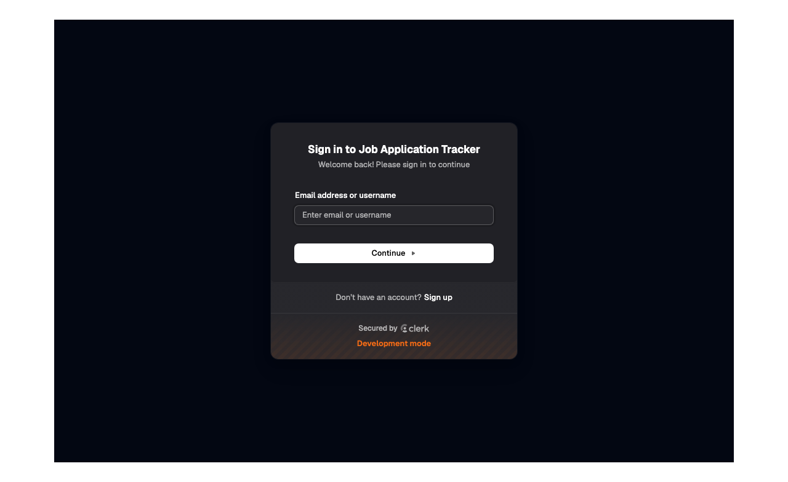
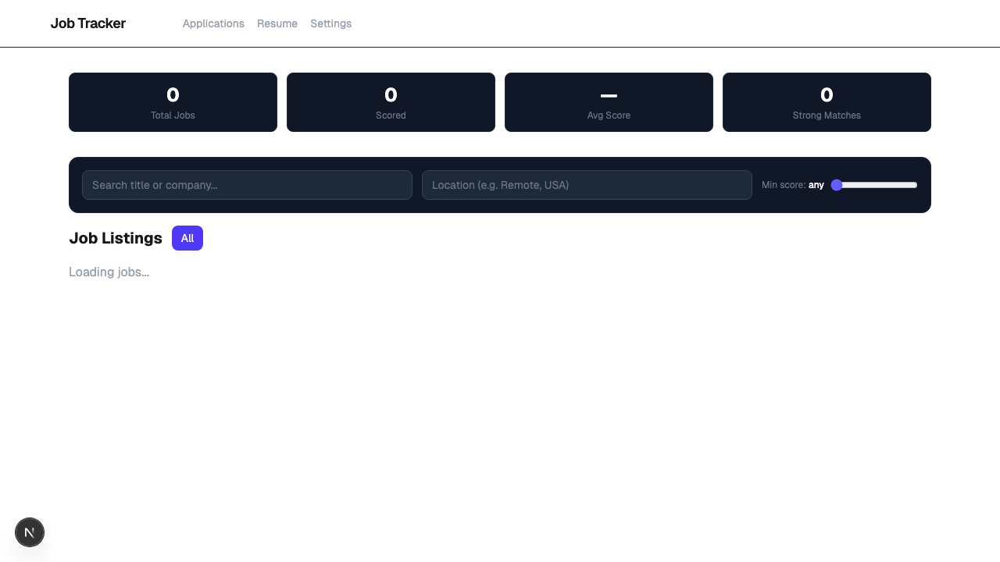
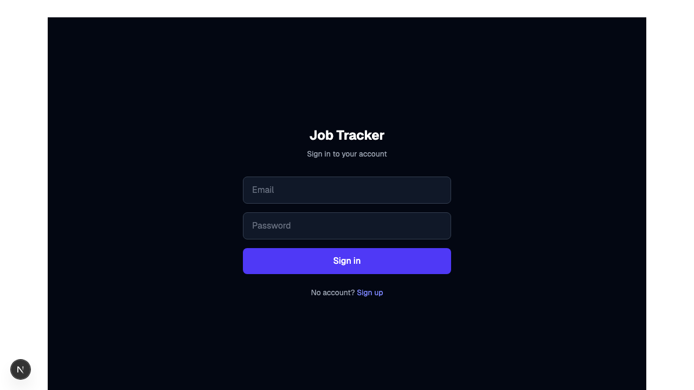

# Job Application Tracker

An AI-powered job tracker that scrapes remote listings daily, scores them against your resume using an LLM, and surfaces the roles most worth your time.

## Features

- **Automated daily scraping** — pulls new listings from RemoteOK, Remotive, The Muse, and LinkedIn via GitHub Actions cron
- **LLM resume matching** — scores each job 0–100 against your resume using Groq's LLaMA 3.1, with breakdown across 7 dimensions: technical skills, experience years, seniority, title alignment, salary extraction, career growth, and domain fit
- **Per-user scoring** — every user uploads their own resume and gets personalized scores; scores are never shared between accounts
- **In-browser scoring** — score all visible jobs at once, score a single listing, or rescore everything after uploading a new resume
- **Score threshold filter** — slide to show only jobs above a minimum match score
- **Application pipeline** — track jobs through Interested → Applied → Interviewing → Rejected / Offer with editable notes per application
- **Stale job cleanup** — GitHub Actions automatically deletes listings older than 30 days (preserving any you've applied to)
- **Daily email digest** — sends a morning summary of your top-scored new listings via SMTP

## Screenshots

Run `npm test` inside `web/` to generate these (see [Testing](#testing)):

| Login | Jobs — scored listings |
|---|---|
|  |  |

| Score detail breakdown | Applications pipeline |
|---|---|
|  |  |

| Score threshold filter | Resume upload |
|---|---|
|  |  |

> Screenshots are generated by Playwright and committed to the repo. Run `npm test` to refresh them after UI changes.

## Tech Stack

| Layer | Technology |
|---|---|
| Frontend | Next.js 16 (App Router), TypeScript, Tailwind CSS |
| Backend | Next.js API Routes (serverless) |
| Database | Supabase (PostgreSQL + Auth + RLS) |
| LLM | Groq API — `llama-3.1-8b-instant` |
| Scraping | Python — RemoteOK, Remotive, The Muse, LinkedIn public API |
| Cron (scrape + score + cleanup) | GitHub Actions — daily at 9am UTC |
| Testing | Playwright (E2E + screenshot showcase) |
| Deployment | Vercel |

## How It Works

```
GitHub Actions (daily)
  └─ scraper/main.py        # fetches new jobs → upserts to `jobs` table
  └─ scorer/main.py         # scores new jobs for every user with a resume
                            # → writes to `user_job_scores` table
  └─ cleanup/main.py        # deletes jobs older than 30 days (keeps applied ones)
  └─ curl /api/digest       # triggers per-user email digest via SMTP

User (browser)
  └─ uploads resume         # POST /api/resume  → stored in `resumes` table
  └─ clicks "Score All"     # POST /api/score   → Groq LLM → user_job_scores
  └─ adjusts score slider   # client-side filter, no network call
  └─ marks as applied       # upserts to `applications` table
  └─ adds notes             # updates applications.notes
```

Scoring uses a structured prompt that evaluates 7 dimensions and responds with a JSON object containing the numeric score, reasoning, "why apply" text, skill gaps, resume tips, extracted salary, and career growth assessment. Both resume and job description are truncated to 3,000 characters to stay within free-tier token limits.

## Project Structure

```
.
├── .github/workflows/
│   └── scrape_and_score.yml   # daily job: scrape → score → cleanup → digest
├── cleanup/
│   └── main.py                # deletes stale jobs (>30 days, no applications)
├── scraper/
│   ├── main.py                # orchestrates all scrapers
│   ├── remoteok.py
│   ├── remotive.py
│   ├── themuse.py
│   ├── linkedin_public.py
│   └── requirements.txt
├── scorer/
│   ├── main.py                # scores unscored jobs for all users with resumes
│   └── requirements.txt
├── supabase/
│   └── migrations/            # SQL migration files (run in order)
└── web/                       # Next.js app
    ├── src/
    │   ├── app/
    │   │   ├── page.tsx           # job listings, scoring, filters
    │   │   ├── applications/      # application pipeline with notes
    │   │   ├── resume/            # resume upload
    │   │   ├── settings/          # keyword/location preferences
    │   │   ├── login/ signup/     # auth pages
    │   │   └── api/
    │   │       ├── score/         # LLM scoring endpoint
    │   │       ├── resume/        # resume upload + PDF extraction
    │   │       ├── preferences/   # user preferences CRUD
    │   │       └── digest/        # per-user email digest endpoint
    │   ├── components/NavBar.tsx
    │   ├── lib/
    │   │   ├── supabase-browser.ts
    │   │   └── supabase-server.ts
    │   └── middleware.ts          # auth route protection
    ├── tests/
    │   ├── e2e/                   # Playwright test specs
    │   └── screenshots/           # committed screenshots from test runs
    └── playwright.config.ts
```

## Local Setup

### Prerequisites

- Node.js 20+
- Python 3.11+
- A [Supabase](https://supabase.com) project
- A [Groq](https://console.groq.com) API key (free tier)

### 1. Database

Run the SQL migration files in order in your Supabase SQL Editor:

```
supabase/migrations/001_initial_schema.sql
supabase/migrations/002_add_scoring_fields.sql
supabase/migrations/003_user_preferences.sql
supabase/migrations/004_score_details.sql
supabase/migrations/005_score_extras.sql
```

Then run this SQL to enable Row Level Security:

```sql
ALTER TABLE resumes ADD COLUMN IF NOT EXISTS user_id UUID REFERENCES auth.users(id);
ALTER TABLE applications ADD COLUMN IF NOT EXISTS user_id UUID REFERENCES auth.users(id);

CREATE TABLE IF NOT EXISTS user_job_scores (
  id UUID PRIMARY KEY DEFAULT gen_random_uuid(),
  user_id UUID NOT NULL REFERENCES auth.users(id) ON DELETE CASCADE,
  job_id UUID NOT NULL REFERENCES jobs(id) ON DELETE CASCADE,
  score NUMERIC(5,2),
  score_reasoning TEXT, why_apply TEXT, gaps TEXT,
  keyword_matches TEXT, keyword_gaps TEXT,
  experience_fit TEXT, title_match TEXT,
  resume_tips TEXT, salary TEXT, career_growth TEXT,
  scored_at TIMESTAMPTZ DEFAULT now(),
  UNIQUE(user_id, job_id)
);

ALTER TABLE resumes ENABLE ROW LEVEL SECURITY;
ALTER TABLE applications ENABLE ROW LEVEL SECURITY;
ALTER TABLE user_job_scores ENABLE ROW LEVEL SECURITY;
ALTER TABLE jobs ENABLE ROW LEVEL SECURITY;

CREATE POLICY "users see own resumes" ON resumes FOR ALL USING (auth.uid() = user_id);
CREATE POLICY "users see own applications" ON applications FOR ALL USING (auth.uid() = user_id);
CREATE POLICY "users see own scores" ON user_job_scores FOR ALL USING (auth.uid() = user_id);
CREATE POLICY "all users read jobs" ON jobs FOR SELECT USING (true);
```

### 2. Web App

```bash
cd web
npm install
npm run dev
```

Create `web/.env.local`:

```env
NEXT_PUBLIC_SUPABASE_URL=https://your-project.supabase.co
NEXT_PUBLIC_SUPABASE_ANON_KEY=your-anon-key
SUPABASE_SERVICE_KEY=your-service-role-key
GROQ_API_KEY=gsk_...
NEXT_PUBLIC_APP_URL=http://localhost:3000

# Optional — email digest
SMTP_HOST=smtp.gmail.com
SMTP_PORT=587
SMTP_USER=you@gmail.com
SMTP_PASS=your-app-password
SMTP_FROM=you@gmail.com
CRON_SECRET=a-long-random-secret
```

### 3. Python Scraper & Scorer

```bash
pip install -r scraper/requirements.txt
```

Create a `.env` file at the project root:

```env
SUPABASE_URL=https://your-project.supabase.co
SUPABASE_SERVICE_KEY=your-service-role-key
GROQ_API_KEY=gsk_...
```

Run manually:

```bash
python scraper/main.py   # fetch new listings
python scorer/main.py    # score jobs for all users with a resume
python cleanup/main.py   # delete jobs older than 30 days
```

## Testing

Tests use [Playwright](https://playwright.dev) for end-to-end testing and screenshot generation. The HTML report (`playwright-report/index.html`) includes all screenshots inline and can be opened in any browser — no server needed.

### Setup

```bash
cd web
cp .env.test.example .env.test
# Fill in TEST_EMAIL and TEST_PASSWORD (a user you created via /signup)
```

### Run

```bash
cd web
npm test                 # run all tests headlessly + generate screenshots
npm run test:ui          # open Playwright's interactive UI mode
npm run test:report      # open the HTML report in your browser
```

Playwright starts the Next.js dev server automatically. Screenshots are written to `web/tests/screenshots/` and committed to the repo so portfolio viewers can see them without running anything.

### What's tested

| Spec | What it covers |
|---|---|
| `01-auth.spec.ts` | Login and signup page rendering |
| `02-jobs.spec.ts` | Stat cards, source filter, score slider, search, rescore button |
| `03-applications.spec.ts` | Pipeline status counts, notes editing, status transitions |
| `04-resume.spec.ts` | Upload form, current resume display, .txt upload flow |
| `05-settings.spec.ts` | Preferences form rendering and field editing |

## Deployment

### Vercel

1. Import the repo in [Vercel](https://vercel.com) and set the **root directory** to `web`
2. Add all environment variables from `web/.env.local`
3. Deploy — API routes run as serverless functions

### GitHub Actions (daily scraper + scorer + cleanup + digest)

Add these secrets under **Settings → Secrets → Actions**:

| Secret | Value |
|---|---|
| `SUPABASE_URL` | Your Supabase project URL |
| `SUPABASE_SERVICE_KEY` | Your service role key |
| `GROQ_API_KEY` | Your Groq API key |
| `APP_URL` | Your deployed Vercel URL |
| `CRON_SECRET` | Same value as `CRON_SECRET` in Vercel env vars |

The workflow runs every day at 9am UTC and can be triggered manually from the Actions tab.

## Usage

1. **Sign up** at `/signup` and confirm your email
2. Go to **Resume** and upload your resume (`.pdf` or `.txt`)
3. Go to **Settings** and enter your target job keywords and preferred locations
4. On **Jobs**, click **Score visible** — the LLM evaluates each listing against your resume
5. Use the **Min score slider** to filter to your strongest matches
6. Click **View listing →** then **Mark as applied** to add it to your pipeline
7. Track progress in **Applications** — move cards through status stages and add interview notes
8. Each morning you'll receive an email digest of new high-scoring jobs (if SMTP is configured)
